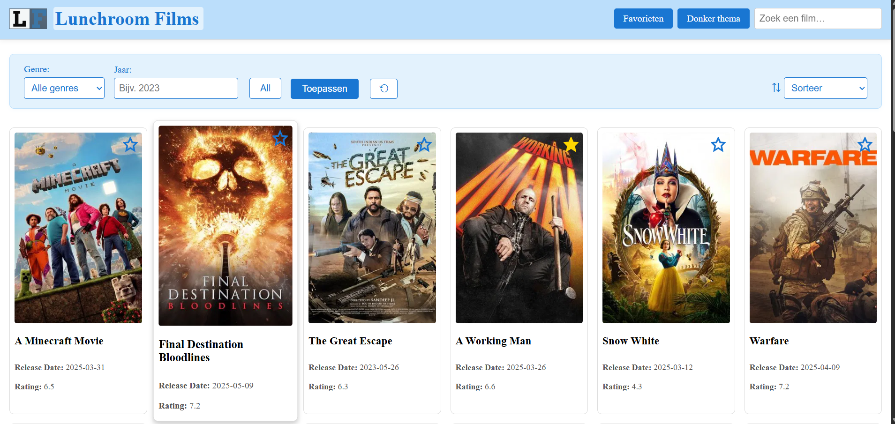
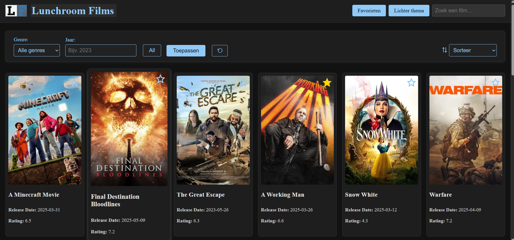
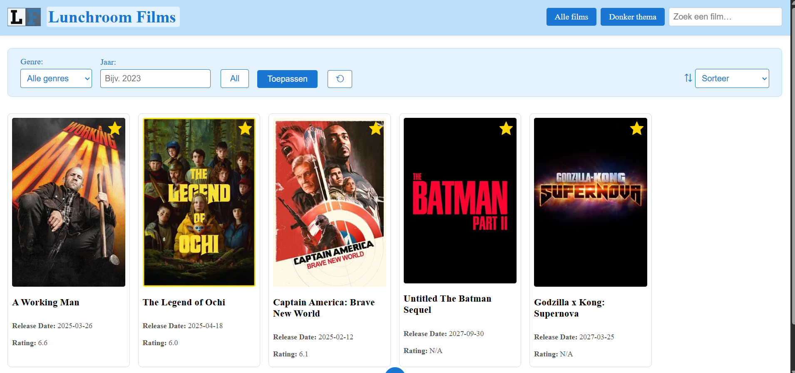
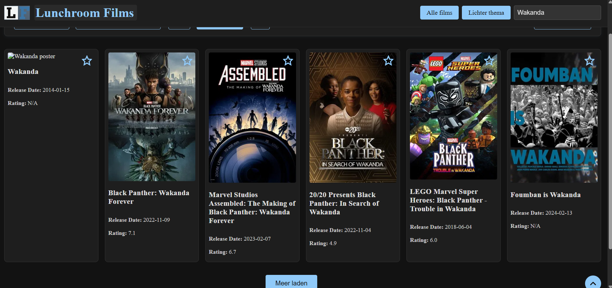
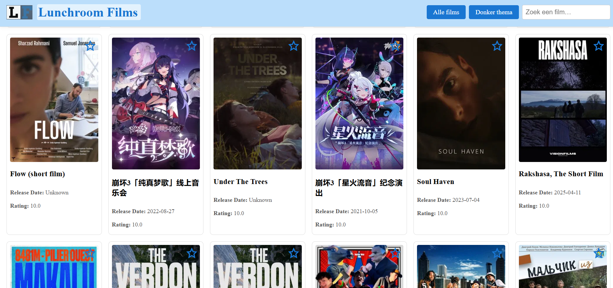
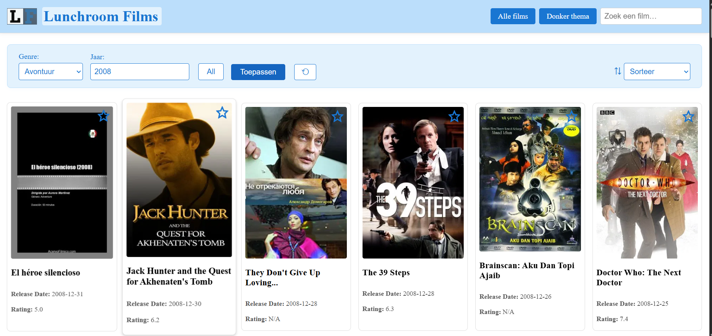
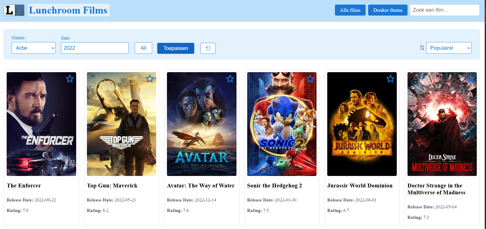

# 🎬 Lunchroom Films

**Interac­tieve Single-Page App voor film­verken­ning en favorieten-beheer**

---

## 📖 Project­beschrijving  
Lunchroom Films is een moderne SPA waarmee je:  
- Populaire films bekijkt (TMDb-trending)  
- Zoekt op filmtitel (live debounce)  
- Filtert op genre & jaar  
- Films toevoegt aan of verwijdert uit favorieten  
- Wisselt tussen licht- en donker­thema  
- Extra films laadt via “Load More”

Gebouwd met Vite, modulaire JS, gescheiden CSS en semantische HTML.

---
## Inhoud
- [Installatie](#-installatie)
- [Screenshots](#-screenshots)
- [Projectstructuur](#-projectstructuur)
- [Troubleshooting](#-troubleshooting)


## 🔗 Gebruikte API  
- **TMDb API** (The Movie Database)  
  - Endpoint: `https://api.themoviedb.org/3`  
  - Documentatie: https://developers.themoviedb.org/3  
  - Implementatie in `src/api.js`

---

## ⚙️ Technische vereisten & implementatie

### 1. DOM-manipulatie  
- **Elementen selecteren**  
  - `document.getElementById('movie-list')` in `src/main.js`  
  - `document.getElementById('favorites-container')` in `src/main.js`  
- **Elementen manipuleren**  
  - `movieContainer.innerHTML = ''` in `renderMovies()`  
  - Dynamisch HTML injecteren met template literals  
- **Events koppelen**  
  - Search: `searchInput.addEventListener('input', debounce(...))`  
  - Thema-toggle: `themeToggle.addEventListener('change', ...)`  
  - Favorieten-knop: click-handler in `renderMovies()`

## 2. Modern JavaScript
- **Constanten**  
  ```js
  // src/api.js, regels 1–2  
  const BASE_URL = 'https://api.themoviedb.org/3'  
  const apiKey   = import.meta.env.VITE_TMDB_KEY

### 📌 Template literals
// src/main.js
card.innerHTML = 
  `<h3>${movie.title}</h3>
  <p>${movie.overview}</p>`
  
### 📌 Iteratie over arrays
movies.forEach(movie => {
  // …})
  
### 📌 Array-methodes
const index = favorites.findIndex(fav => fav.id === movie.id)

### 📌 Arrow functions
// src/utils.js
export const debounce = (fn, delay = 300) => { … }

### 📌 Ternary operator
const star = isFavorite ? '★' : '☆'

### 📌 Callback functions
return (...args) => {
  clearTimeout(timeoutId)
  timeoutId = setTimeout(() => fn(...args), delay)
}

### 📌 Promises
fetch(url)
  .then(res => res.json())
  .then(json => json.results)
  
### 📌 Async & Await
async function loadPopularMovies() {
  const movies = await getPopularMovies()
  renderMovies(movies)
}

### 📌 Observer API (optioneel)
const observer = new IntersectionObserver(callback, options)

## 3. Data & API
### 📦 Data ophalen via fetch
export function getPopularMovies() {
  return fetch(`${BASE_URL}/movie/popular?api_key=${apiKey}`)
}

### 📦 JSON-manipulatie
fetch(url)
  .then(res => {
    if (!res.ok) throw new Error(res.status)
    return res.json()
  })
  .then(json => json.results)
  
## 4. Opslag & Validatie
### ✅ Formuliervalidatie
if (!query.trim()) {
  loadPopularMovies()
  return
}
### 💾 LocalStorage
const favorites = JSON.parse(localStorage.getItem('favorites') || '[]')
localStorage.setItem('favorites', JSON.stringify(favorites))

## 5. Styling & Layout
### 🧱 HTML (semantisch)
<header>…</header>
<main>
  <section id="movie-list"></section>
</main>
<footer>…</footer>

### 🧩 CSS Grid & Flexbox
#movie-list {
  display: grid;
  grid-template-columns: repeat(auto-fit, minmax(200px, 1fr));
  gap: 1rem;
}

### 🎨 Basis CSS
.movie-card { … }
.favorite-btn { … }

### ✨ Gebruiksvriendelijke elementen
Hover-effects
Duidelijke knop-icons
Loading- en foutmeldingen

## 6. Tooling & Structuur
### ⚡ Vite Setup
npm init vite@latest movie-app -- --template vanilla

## Installatie
Volg deze stappen om het project lokaal te draaien:

1. Clone de repository
git clone https://github.com/EmDev16/lunchroom-films.git
cd lunchroom-films

2. Installeer afhankelijkheden (indien van toepassing)
npm install

3. Maak een .env bestand aan
Voeg een .env bestand toe in de hoofdmap met je API-sleutel of andere omgevingsvariabelen:
VITE_TMDB_KEY=6671f55f078a9782a57acf368371a49e

4. Start de development server
Bijvoorbeeld (voor Node.js):
npm run dev

## Screenshots
Dit is een voorbeeld van hoe de applicatie eruitziet:
| Light theme                  | Dark theme                    |
|------------------------------|-------------------------------|
|  |  |

Wanneer je naar de favorieten gaat:


En hier zie je het gebruik van verschillende functies in actie:
| Search                    | Sort                 |
|------------------------------|-------------------------------|
|  |  |
 
 | Filter                    | Sort/filter                 |
 |------------------------------|-------------------------------|
|  |  |


### 📁 Projectstructuur
movie-app/
├ public/           # Statische assets (favicon, afbeeldingen, etc.)
├ src/              # Broncode
│  ├ api.js         # API-aanroepen
│  ├ main.js        # Entreepunt JS
│  ├ style.css      # CSS-bestand
│  └ utils.js       # Hulpfuncties
├ .env              # Omgevingsvariabelen (niet committen!)
├ .gitignore        # Git-ignorebestand
├ index.html        # HTML-pagina
└ package.json      # Projectconfiguratie en scripts

## 🌐 Live demo
Bekijk de live versie van Lunchroom Films hier:  
[](https://EmDev16.github.io/lunchroom-films/)

## Gebruikte bronnen
- **Vite**
https://vitejs.dev/

- **CSS-Tricks**
https://css-tricks.com/

- **AI-assistentie via ChatGPT**
https://chatgpt.com/share/682ccf29-18d4-8002-b881-a4889c36a663

- **AI-assistentie via GitHub Copilot (sessie 1)**  
<script src="https://gist.github.com/EmDev16/3e1a57a947818c8da01bd6255be6560a.js"></script>

- **AI-assistentie via GitHub Copilot (sessie 2)**  
<script src="https://gist.github.com/EmDev16/746a438f3c29e4beea0ef6b09ea69c58.js"></script>

## Troubleshooting
1. Ensure the `.env` file contains a valid `VITE_TMDB_KEY`.
2. Check the browser console for API errors or warnings.
3. Verify network requests using browser developer tools.
4. If movies are not displayed, check the API response in `src/api.js`.
5. Log the API key in `src/main.js` and `src/api.js` to ensure it's being used correctly.
